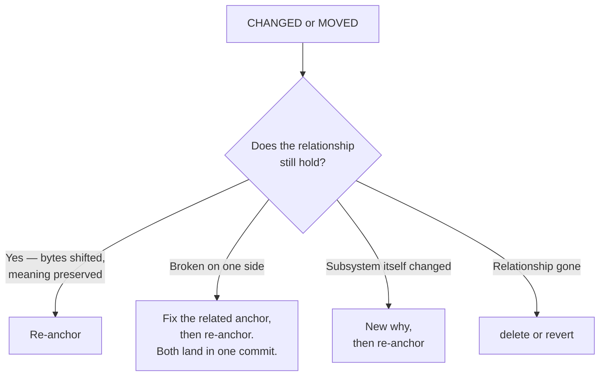

# Responding to drift

A `CHANGED` or `MOVED` finding is a prompt, not a verdict. Decide whether the relationship the mesh describes still holds before reaching for any command — including when many meshes drift at once. Per-mesh judgment is required even when the same mechanism appears to apply to all of them; bulk loops that re-add every recorded anchor verbatim convert "this needs review" into a clean exit code without anyone confirming the relationship survived. See `./terminal-statuses.md` § "ORPHANED" for the same warning in the orphan case.



## When the relationship still holds: re-anchor

**Same `(path, extent)`, bytes changed.** A second `git mesh add` over the identical span is a re-anchor (last-write-wins). The staged add's sidecar captures current bytes, which shows `(ack)` in stale output. No `remove` required.

```bash
git mesh add <name> 'server/routes.ts#L13-L34'
git mesh commit <name>
```

**Different line span — the anchor moved.** A span that does not exactly match an existing anchor is treated as *new*. Remove the old first:

```bash
git mesh remove <name> 'server/routes.ts#L13-L34'
git mesh add    <name> 'server/routes.ts#L15-L36'
git mesh commit <name>
```

This is the only time `git mesh remove` appears in a re-anchor workflow. Otherwise, `remove` only removes an anchor from the mesh entirely.

**`MOVED` with identical bytes.** Usually leave it — the anchor follows. Re-anchor only if the new location is the one the mesh should point at going forward.

## When the related code or doc is broken: fix, then re-anchor

The bytes changed and one side now contradicts the other (e.g., the request shape moved but the parser did not). Fix the broken side first, then re-anchor. Both sides should land in the same commit so history shows the relationship was kept whole.

## When the subsystem itself changed: new why, then re-anchor

Mesh commits inherit the previous why when none is staged. Routine re-anchors carry the definition forward unchanged. Stage a new why **only when the subsystem itself changes** — not as a changelog. Write it as a durable answer to "what subsystem do these anchors form?". Caveats, invariants, ownership, and review triggers belong in source comments, commit messages, CODEOWNERS, and PR descriptions.

```bash
git mesh why <name> -m "Token verification flow that lets the API trust a request bearer signed by the auth service."
git mesh commit <name>
```

## When the relationship no longer exists: delete or revert

```bash
git mesh delete <name>                    # tear down the mesh
git mesh revert <name> <commit-ish>       # restore a prior correct state as a new commit
```

`delete` refuses to run while staged ops remain for `<name>`; run `git mesh restore <name>` first to discard the staged work, then retry. `revert` writes a new commit that reinstates a prior mesh state — prefer it when a past state was correct and history should show the restoration. `move` (rename) and `restore` (clear staging) round out the structural set; see `./command-reference.md` § "Structural".

## Prose meshes drift more often than code

Prose anchors (ADRs, contracts, runbooks, API docs) churn for editorial reasons that don't change meaning: prettier or dprint reflow, heading renumbers, sentence rewrites, link sweeps. The current drift detector is line-range + blob-OID; it has no sense of "the meaning is preserved." Expect prose meshes to surface `CHANGED` more often than code meshes.

Defaults for prose meshes:
- **Whole-file anchor** when the document is consumed as a unit (license, one-page ADR, published RFC). `CHANGED` then means "the bytes of this document are not what they were when you pinned it" — a real prompt to reread.
- **Line-range anchor** only when the doc has stable structural landmarks (numbered ADRs, contract clauses, threat-model items with stable IDs) and the team accepts re-anchoring on editorial passes.
- **`ignore-whitespace true`** is usually right for prose — Markdown reflow is whitespace-shaped within a paragraph. It does not help when reflow moves lines across paragraphs.

When a prose `CHANGED` finding fires, run the same decision tree above. Editorial-only changes that preserve meaning re-anchor unchanged; a doc that now says something different needs the related side fixed first; a wholesale rewrite is the moment to ask whether the relationship survives at all.

## Resolver config

`git mesh config <name> copy-detection <value>` and `git mesh config <name> ignore-whitespace <bool>` shape every future finding for this mesh. See `./command-reference.md` § "Configuration" for keys, values, and usage notes.
